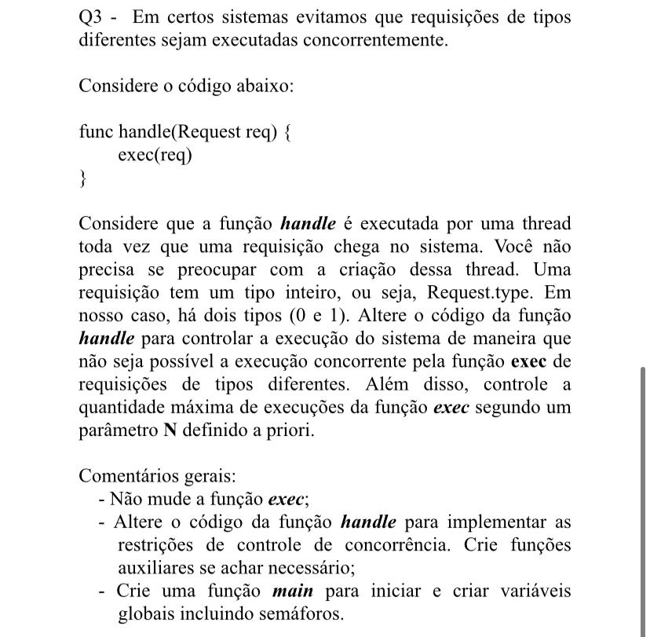

# Pseudo-código para a questão handle

## Enunciado questão


## Resposta
```python
N = 2
sem_lock = Semaphore(1)
s0 = Semaphore(N)
s1 = Semaphore(N)
turnstile = Semaphore(1)
mutex0 = Semaphore(1)
mutex1 = Semaphore(1)

zeros = 0
ums = 0


def lockRequestType(sem, count, mutex):
    mutex.wait()
    count += 1
    if count == 1:
        sem.wait()
    mutex.signal()    


def unlockRequestType(sem, count, mutex):
    mutex.wait()
    count -= 1
    if count == 0:
        sem.signal()
    mutex.signal()    


def handle(req):
    if req.type == 0:
        turnstile.wait()
        lockRequestType(sem_lock, zeros, mutex0)
        turnstile.signal()
        s0.wait()

        exec() 

        s0.signal()
        unlockRequestType(sem_lock, zeros, mutex0)

    elif req.type == 1:
        turnstile.wait()
        lockRequestType(sem_lock, ums, mutex1)
        turnstile.signal()
        s1.wait()

        exec()
        
        s1.signal()
        unlockRequestType(sem_lock, ums, mutex1)
```